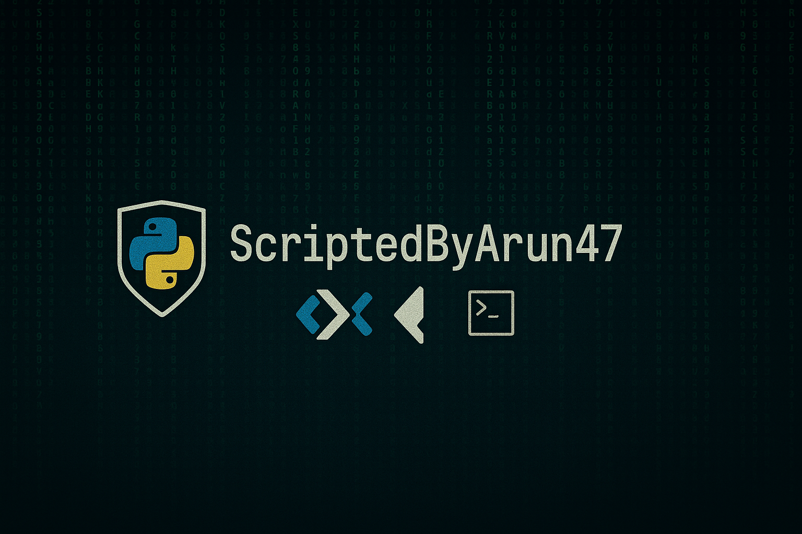

<h1 align="center">Hey 👋, I'm ArunKumar L</h1>
<h3 align="center">Python dev by day, cybersecurity enthusiast by night 🐍💻🛡️</h3>

- 🌦️ Currently working on: **Premium Weather App using KivyMD**
- 🔐 Recently built: **PasswordCrackJS** — Node.js tool for password generation and brute-force simulation
- 🔍 Exploring: Android app development with Buildozer
- 🧠 Learning: System design, Python internals, and cross-platform UI
- 💬 Ask me about: Python, Kivy, Linux, JavaScript, and ethical hacking
- 🛠️ Skilled in: **Python Development**, **JavaScript**, and **Cybersecurity**
- 📫 Reach me: [akisback049@gmail.com](mailto:akisback049@gmail.com)
- ⚡ Fun fact: I can design apps that feel like the weather is talking 😎

---

### 🧰 Tech Stack

  
  
  
  
  
  
  
  

---

### 📊 GitHub Stats

  

  

  

---

### 🔗 Connect with Me

  <a href="mailto:akisback049@gmail.com">Email: akisback049@gmail.com</a>

